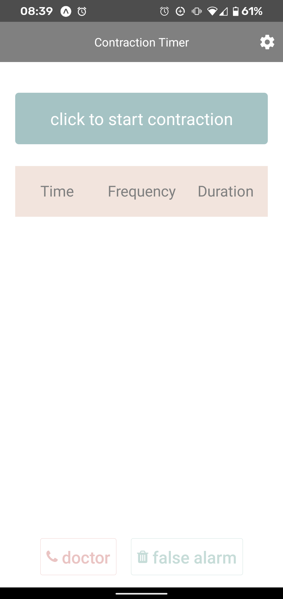
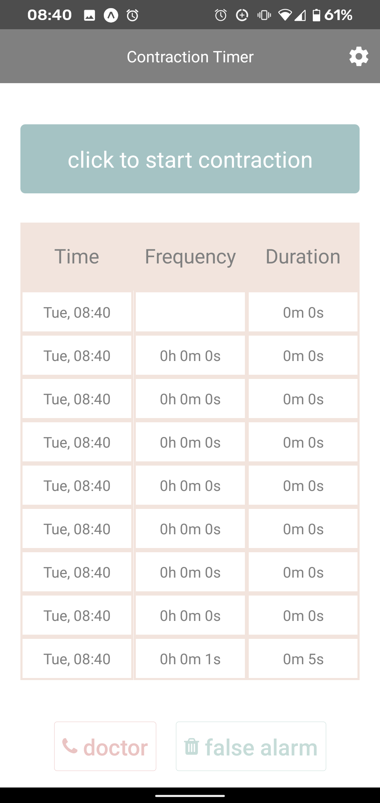
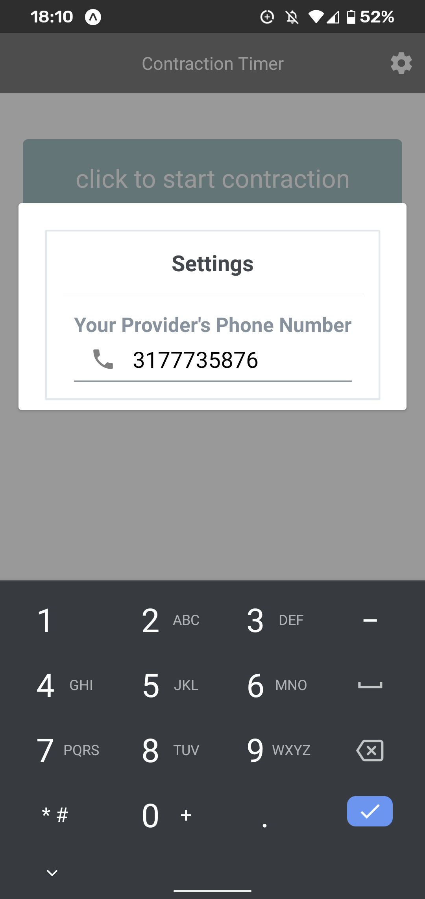

# contraction-counter
This will count the contraction duration and frequency, as well as notify you when you should contact the doctor, and when you should head to the hospital. 

[](https://expo.io/)

## Screenshots


## Spin-up
```bash
> npm i
> npm start
```

## Run Tests
This repo contains Jest tests

```bash 
> npm test
```

## Disclaimer
I'm a terrible person and never tested what it looks like for iOS :grimacing:
